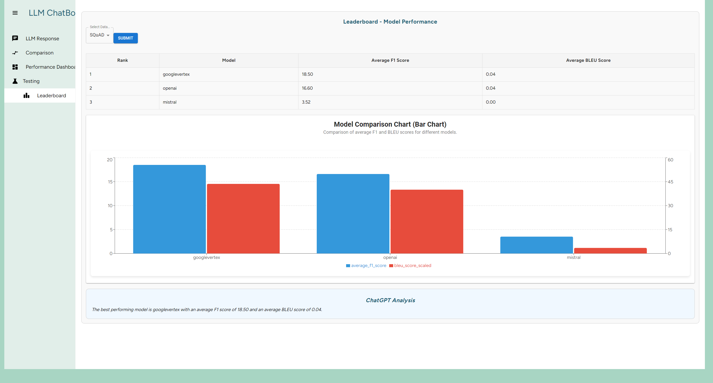

# LLM Performance Comparison Platform

## Introduction

Welcome to the **LLM Performance Comparison Platform**! This project, built as an internship challenge, provides a web-based platform that enables users to compare the performance of various Large Language Models (LLMs) on both custom queries and standardized evaluation datasets. This project offers practical experience in web development, API integration, and AI model evaluation techniques.

## Objective

The platform allows users to:

- Input custom queries for multiple LLMs and view responses side-by-side.
- Select LLMs for querying and viewing responses.
- Compare model performance using standardized datasets and metrics.
- Visualize and analyze evaluation results.

## Core Features

### 1. Frontend Development
The frontend features a responsive web interface that includes:
- **Query Input**: An input field for custom queries.
- **Model Selection**: A selection mechanism for choosing LLMs to query.
- **Response Display**: A section to display and compare responses from each selected LLM.
- **Dashboard**: A performance dashboard showing evaluation results and metrics.


*The main chat interface allows users to select LLM models and input queries to compare responses side-by-side.*

### 2. Backend Development
The backend, built with Flask, manages API requests and evaluation logic:
- **API Routing**: Routes for querying LLMs and processing results.
- **Query Distribution**: Logic to distribute queries to selected LLM APIs and aggregate results.
- **Evaluation Datasets**: Supports standardized datasets and computes performance metrics.

### 3. LLM API Integration
The platform integrates with the following APIs:
- OpenAI GPT API
- Anthropic Claude API
- Mistral AI API
- Google API (alternative)

**Key Features**:
- **API Key Management**: Secure storage of API keys.
- **Error Handling**: Error management and rate-limiting for smooth operation.

### 4. Standardized Evaluation Integration
The platform supports evaluation using various datasets:
- **GLUE (General Language Understanding Evaluation)**
- **SuperGLUE**
- **SQuAD**
- **TruthfulQA**
- **MMLU (Massive Multitask Language Understanding)**

The evaluation pipeline:
- Loads tasks from chosen datasets.
- Queries each integrated LLM.
- Collects and stores responses.
- Computes performance metrics per dataset specifications.

### 5. Results Display and Visualization
The platform provides:
- **Comparison Interface**: Side-by-side evaluation of LLM responses to custom queries.
- **Performance Dashboard**: Visualization tools, including charts and graphs, for comparing LLM performance across various tasks and metrics.


*The comparison interface enables side-by-side viewing of LLM responses, helping users evaluate the quality and relevance of answers across different models.*


*The performance dashboard visualizes key metrics like F1 Score, BLEU Score, and ROUGE Score, providing insights into model effectiveness across tasks.*

## Example Evaluations and Leaderboard

### Model Comparison Results
The platform's evaluation interface allows users to filter by dataset, sample size, and specific experiment IDs to view detailed performance metrics.


*The evaluation results table displays metrics like BLEU and ROUGE scores for each sampled response, giving detailed insights into model accuracy and quality.*


*The leaderboard ranks models based on their average F1 and BLEU scores across chosen datasets, highlighting the best-performing LLM.*

## Setup and Installation

### Prerequisites
- **Node.js** for the frontend.
- **Python** for the Flask backend.
- **API Keys**: Obtain API keys for OpenAI GPT, Anthropic Claude, Mistral AI, and Google.

### Clone the Repository
```bash
git clone https://github.com/lionggele/Chatbox_LLM-new.git
cd Chatbox_LLM-new
```

### Install Dependencies

#### Frontend Setup
1. Navigate to the `src` directory:
   ```bash
   cd src
   ```
2. Install frontend dependencies:
   ```bash
   npm install
   ```

#### Backend Setup
1. Navigate to the `server` directory:
   ```bash
   cd server
   ```
2. Set up a virtual environment:
   ```bash
   python -m venv venv
   source venv/bin/activate  # On Windows use `venv\Scripts\activate`
   ```
3. Install Python packages:
   ```bash
   pip install -r requirements.txt
   ```

### API Key Setup
1. Create a `.env` file in the root directory to securely store API keys:
   ```plaintext
   OPENAI_API_KEY=your_openai_api_key
   MISTRAL_API_KEY=your_mistral_api_key
   GOOGLE_API_KEY=your_google_api_key
   ```

### Running the Application

#### Frontend
To start the frontend:
```bash
npm start
```

#### Backend
To start the backend:
```bash
python app.py
```

### Access the Application
Access the platform at:
```
http://localhost:3000
```

## Resources

- **SQuAD**: [SQuAD Explorer](https://rajpurkar.github.io/SQuAD-explorer/)
- **TruthfulQA**: [TruthfulQA GitHub](https://github.com/sylinrl/TruthfulQA)
- **OpenAI GPT API Documentation**: [OpenAI Docs](https://platform.openai.com/docs/)
- **Mistral AI API**: [Mistral AI Docs](https://docs.mistral.ai/api/)
- **Google API Documentation**: [GoogleAPI Docs](https://ai.google.dev/gemini-api/docs/api-key)

## Project Structure

```plaintext
Chatbox_LLM-new/
│
├── public/                      # Public assets (favicon, logo, manifest files)
│
├── src/                         # Frontend source code
│   ├── assets/                  # Images, icons, and static resources for UI
│   ├── Data/                    # API calls and data-fetching logic
│   ├── Domain/                  # Domain models and business logic
│   ├── Presentation/            # Components for rendering the UI
│   ├── Routes/                  # Page routing configurations and React Router setup
│   ├── App.js                   # Main App component (root of the React app)
│   ├── index.js                 # Entry point for React application rendering
│   ├── styles.css               # Global CSS styles for the app
│   └── config/                  # Configuration files (e.g., environment settings)
│
├── server/                      # Backend source code
│   ├── app.py                   # Main Flask server application file
│   ├── routes/                  # API route handlers for LLM queries and processing
│   ├── utils/                   # Utility functions (e.g., data processing, API key management)
│   ├── config.py                # Backend configuration settings and environment variables
│   └── requirements.txt         # Python dependencies
│
├── .env                         # Environment variables (not committed)
├── package.json                 # Project dependencies for the frontend
├── README.md                    # Project documentation (this file)
└── docker/                      # Docker configuration files (Dockerfile, docker-compose.yml for containerized setup)
```

